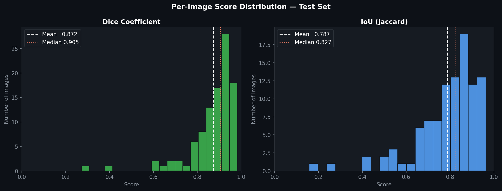
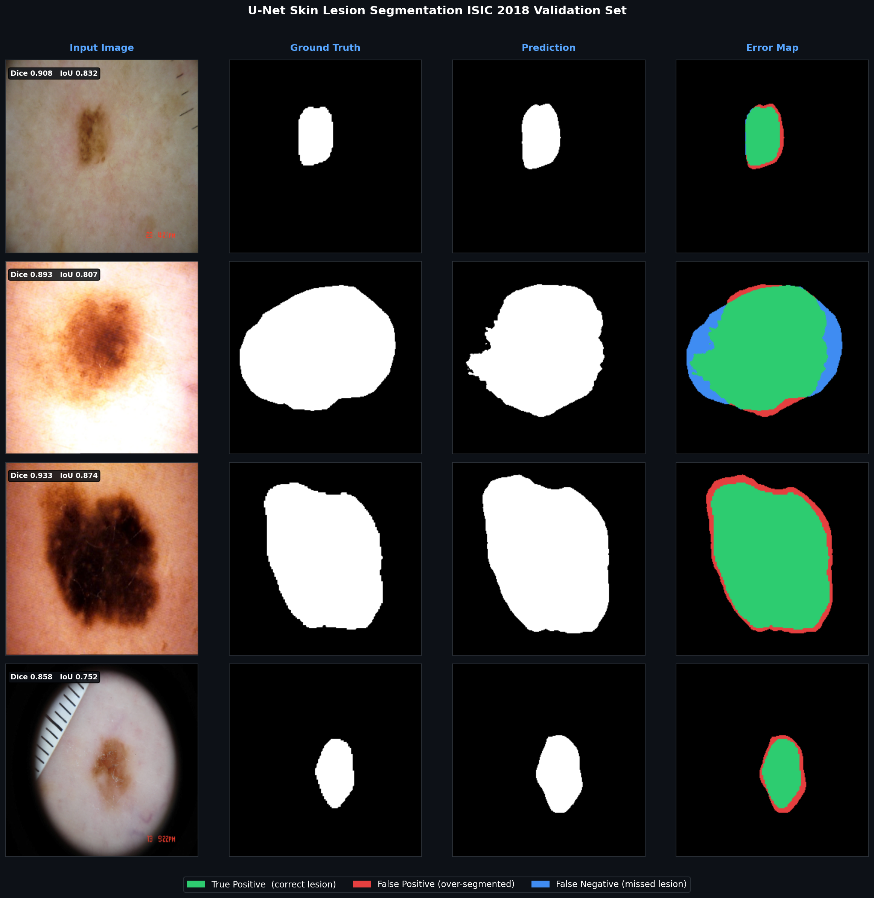
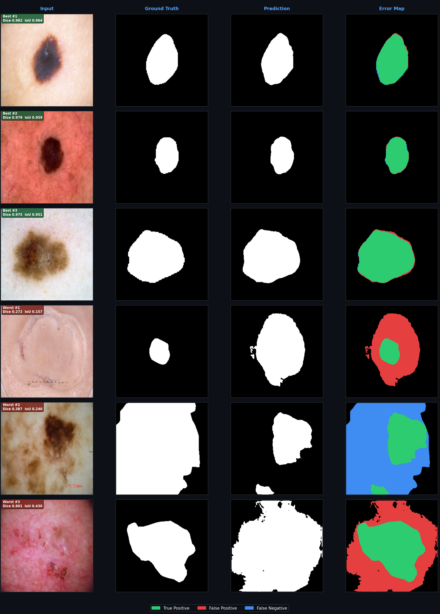

# Skin Lesion Segmentation for Melanoma Detection with U-Net


Automated segmentation of dermoscopic skin lesion images using a **U-Net with ResNet-34 encoder**, trained and evaluated on the [ISIC 2018 Challenge Dataset](https://challenge.isic-archive.com/data/#2018). 

Melanoma is the most serious form of skin cancer, and early detection is crucial to improve treatment outcomes. Automated skin lesion detection assist medical professionals in early diagnoses by highlighting lesion areas for further investigation.  Accurate lesion boundary detection is a critical step in computer-aided melanoma diagnosis and this pipeline achieves a **Dice coefficient of 0.872** on the ISIC 2018 validation dataset.


## Results

Evaluated on the held-out ISIC 2018 validation set (100 images never seen during training)

| Metric | Score |
|--------|-------|
| Dice Coefficient | 0.872 +/- 0.112 |
| IoU (Jaccard) | 0.787 +/- 0.146 |
| Pixel Accuracy | 0.9236 |



> A Dice score of 0.872 means the predicted lesion boundary overlaps 87% of
> the true lesion region on average. These results are comparable to published results.


## Model Development

**Model Type:** Convolutional Neural Network

**Model Architecture:** U-Net with ResNet34 encoder backbone  

The U-Net architecture is specifically designed for image segmentation tasks, allowing for precise localization of features while maintaining context through its encoder-decoder structure. 

**Data Preprocessing**
- Resized images to 256x256
- Normalized using imagenet mean/std
- Augmentations applied for training: random horizontal & vertical flips, rotation, color jitter (brightness, contrast, saturation)

### Loss Function

Combined Binary Cross-Entropy + Dice Loss to handle class imbalance and background pixels. 


### Training Setup

- Optimizer: Adam (lr=1e-4, weight_decay=1e-5)
- Scheduler: ReduceLROnPlateau (patience=5, factor=0.5)
- Early stopping: patience=10 on validation Dice
- Train/val split: 85/15 from 2,594 training images
- Final validation: 100-image held-out ISIC 2018 validation set


## Visual Analysis

### TP / FP / FN Region Breakdown




Clinically, False Negatives carry higher risk than False Positives, a missed
lesion region could mean an incomplete biopsy or understaged diagnosis.

### Best & Worst Predictions



The model performs best on mid-sized lesions with clear colour contrast against
surrounding skin. Performance degrades on low-contrast lesions, cases with heavy
hair occlusion, and very small lesion areas.


## Dataset

[ISIC 2018 Challenge — Task 1: Lesion Boundary Segmentation](https://challenge.isic-archive.com/data/#2018)

- **Training set:** 2,594 dermoscopic images with ground truth binary masks
- **Test set:** 100 held-out images (ISIC 2018 validation split)
- **Class balance:** ~30% lesion pixels, ~70% background


## How to run pretrained model on ISIC 2018 test data

### 1. Setup
Ensure Python 3.8+ is installed, create and activate conda environment
```bash
pip install -r requirements.txt
```

### 2. Download the test images
Download test images from here: [ISIC 2018 Task 1](https://challenge.isic-archive.com/data/#2018)

Unzip into `data/raw/`

### 3. Download the pretrained model
Download model weights here: [Saved Model](https://drive.google.com/drive/folders/1JFgsuG_9qVA6KXmwuOLF_C7Q9gnwR_Pj?usp=sharing)


### 4. Run the model on test data
```bash
python src/inference.py --image-path data/raw/ISIC2018_Task1-2_Test_Input --model-weight models/best_model.pth --output-path prediction
```
Predicted masks will be saved to prediction folder


## How to train a model

### 1. Setup
Ensure Python 3.8+ is installed, create and activate conda environment
```bash
pip install -r requirements.txt
```

### 2. Download the training data images
Download images from here: [ISIC 2018 Task 1](https://challenge.isic-archive.com/data/#2018)

- `ISIC2018_Task1-2_Training_Input`
- `ISIC2018_Task1_Training_GroundTruth`
- `ISIC2018_Task1-2_Validation_Input`
- `ISIC2018_Task1_Validation_GroundTruth`

Unzip all four into `data/raw/`

### 3. Train the model

```bash
python src/train.py --epochs 30 --batch_size 8 
```

### 4. Evaluate on held-out test set
```bash
python src/evaluate_test_set.py
```

### 5. Visualize Results
```bash
python src/visualize_results.py
```


## Project Structure
```
skin-lesion-segmentation/
├── data/raw/                     # ISIC images and masks (downloaded from site)
├── src/
│   ├── dataset.py                
│   ├── model.py                  
│   ├── train.py                  # Training loop with early stopping
│   ├── evaluate.py               # Dice, IoU, pixel accuracy metrics
│   ├── evaluate_test_set.py      # Held-out test set evaluation
│   ├── visualize_results.py      # Visualize results on test set
│   └── inference.py              # Run inference on test data
├── models/                       # Saved model weights 
├── results/
│   ├── figures/               
├── prediction/                   # Inference output will save here
├── requirements.txt
└── README.md
```


## License

MIT — see [LICENSE](LICENSE).

